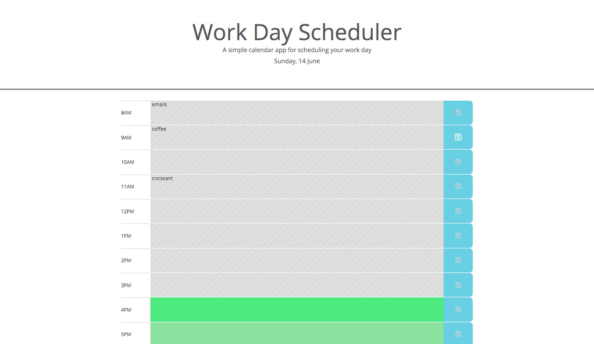

# Work Day Scheduler

## Description
A day schedule for the current day that allows the user to save events for each hour.
This app features dynamically updated HTML and CSS powered by jQuery, the use of Moment.js, and use of the browser local storage.

Screenshot of application:

## Usage
Link to deployed site: https://y-ilin.github.io/homework5-Work-Day-Scheduler/

## License
Licensed under the MIT License.

## Contributing
To contribute directly to the code base, please see this [How to Contribute](https://github.com/Microsoft/vscode/wiki/How-to-Contribute) document.
